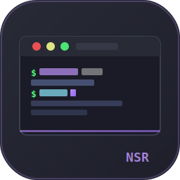

<p align="center">
  
</p>

<h1 align="center">NSR-SSH</h1>

<p align="center">
  <strong>No Subscription Required</strong><br/>
  A native SSH client for Linux — no cloud, no telemetry, no monthly fee.
</p>

<p align="center">
  
  
  
  
  
</p>

---

> It's a shame that you need to pay $15/month to use a good SSH client — often without new features or updates — just to get "Cloud Synchronization". So, use this project, modify it, and do whatever the f*ck you want with it.

---

## What's working now (v0.1.x)

### Terminal
- Full SSH terminal with PTY support via **russh**
- VT100/VT220 emulation (vt100 crate)
- Keyboard input: arrows, Ctrl+letters, F1–F12, Page Up/Down, Home/End
- Copy selected text, paste from clipboard (`Ctrl+Shift+V`)
- Save terminal contents to `.txt` (`Ctrl+Shift+S`)
- Session recording to `.log` file

### Tabs & Panes
- Multiple tabs, each with an independent SSH session
- Split panes: **horizontal** (`Ctrl+Shift+\`) and **vertical** (`Ctrl+Shift+-`)
- Drag tabs onto the central area to split into panes (left / right / top / bottom drop zones)
- Resize panes by dragging the separator
- Detach a pane into its own tab
- Navigate tabs: `Ctrl+Tab` / `Ctrl+Shift+Tab`
- Close pane/tab: `Ctrl+W`

### Vault (host manager)
- Sidebar with all saved hosts
- Search/filter by alias, hostname, or tag
- Add, edit, duplicate, delete hosts
- Tags for visual grouping
- Syncs bidirectionally with `~/.ssh/config` on every save
- Auto-detects manual edits to `~/.ssh/config` and imports them
- **Export vault** to `vault.json` (file dialog)
- **Import vault** from `vault.json` with merge (no duplicates)
- **Automatic sync** via a user-configured folder (Syncthing, Nextcloud, rclone, Dropbox, etc.) — set in Settings → SSH

### Connections
- Password authentication
- SSH key authentication (`IdentityFile`)
- Reconnect button on session drop
- TCP latency display in the footer (IPv4 + IPv6, colored by threshold)
- Session uptime counter

### UI / UX
- Custom titlebar (no OS decorations): minimize, maximize/restore, close
- Drag window by the tab bar
- Wayland-native (eframe + winit, OpenGL via glutin)
- Welcome screen with quick actions and recent hosts search
- Dark theme (Dracula built-in), extensible via TOML files in `~/.config/nsr-ssh/themes/`
- Settings page: font size, scrollback lines, theme selector, shortcuts reference, sync path
- Footer: version (clickable → GitHub releases), session count, host count, IP, latency, uptime
- **Auto update checker**: checks GitHub Releases on startup, shows badge when a new version is available

---

## Planned (v0.2+)

| Feature | Notes |
|---|---|
| More built-in themes | Nord, Catppuccin, Solarized |
| Custom theme editor | Live preview |
| WASM plugins | Extism sandbox, load from `~/.config/nsr-ssh/plugins/*.wasm` |
| Lua 5.4 scripts | mlua, Neovim-style API |
| Auto-update (binary) | Download & replace binary from GitHub Releases |
| Windows support | via eframe cross-platform backend |
| macOS support | via eframe cross-platform backend |
| SSH agent forwarding | |
| Port forwarding / tunnels | Local and remote |
| Session logging (search) | Full-text search across recorded sessions |
| Publish to crates.io | `cargo install nsr-ssh` |

---

## Install

### From source (requires Rust 1.78+)

```bash
git clone https://github.com/vagkaefer/nsr-ssh.git
cd nsr-ssh
cargo build --release
./target/release/nsr-ssh
```

### Dependencies (Linux)

```bash
# Fedora / RHEL
sudo dnf install openssl-devel pkg-config

# Ubuntu / Debian
sudo apt install libssl-dev pkg-config
```

Wayland is used by default. X11 fallback works via XWayland.

---

## Configuration

| Path | Purpose |
|---|---|
| `~/.config/nsr-ssh/vault.json` | Host vault (primary store) |
| `~/.ssh/config` | Synced automatically on every save |
| `~/.config/nsr-ssh/themes/*.toml` | Custom color themes |
| `~/.config/nsr-ssh/plugins/` | WASM / Lua plugins (v0.2) |

### Theme format (`~/.config/nsr-ssh/themes/my-theme.toml`)

```toml
name = "My Theme"
background = [30, 30, 46]
foreground = [205, 214, 244]
cursor     = [137, 180, 250]
ui_accent  = [137, 180, 250]

[ansi_colors]
black   = [45, 45, 68]
red     = [243, 139, 168]
green   = [166, 227, 161]
yellow  = [249, 226, 175]
blue    = [137, 180, 250]
magenta = [203, 166, 247]
cyan    = [137, 220, 235]
white   = [186, 194, 222]
bright_black   = [88, 91, 112]
bright_red     = [243, 139, 168]
bright_green   = [166, 227, 161]
bright_yellow  = [249, 226, 175]
bright_blue    = [137, 180, 250]
bright_magenta = [203, 166, 247]
bright_cyan    = [137, 220, 235]
bright_white   = [166, 173, 200]
```

---

## Keyboard shortcuts

| Action | Shortcut |
|---|---|
| New connection | `Ctrl+T` |
| Close pane / tab | `Ctrl+W` |
| Split horizontal | `Ctrl+Shift+\` |
| Split vertical | `Ctrl+Shift+-` |
| Toggle vault sidebar | `Ctrl+B` |
| Settings | `Ctrl+,` |
| Next tab | `Ctrl+Tab` |
| Previous tab | `Ctrl+Shift+Tab` |
| Save terminal to file | `Ctrl+Shift+S` |
| Paste | `Ctrl+Shift+V` |

---

## Project structure

```
nsr-ssh/
├── crates/
│   ├── nsr-ssh/      # binary entry point
│   ├── nsr-core/     # SSH session lifecycle, channels, events
│   ├── nsr-vault/    # host store, ~/.ssh/config sync, export/import
│   ├── nsr-ui/       # all egui widgets (app, tabs, panes, terminal, vault panel, settings)
│   ├── nsr-theme/    # Theme struct, built-in themes, TOML loader
│   └── nsr-plugin/   # plugin API stubs (WASM + Lua, v0.2)
└── assets/
    ├── icons/        # app icons (16 → 256px + SVG)
    └── themes/       # built-in theme TOML files
```

---

## License

MIT — do whatever the f*ck you want.
